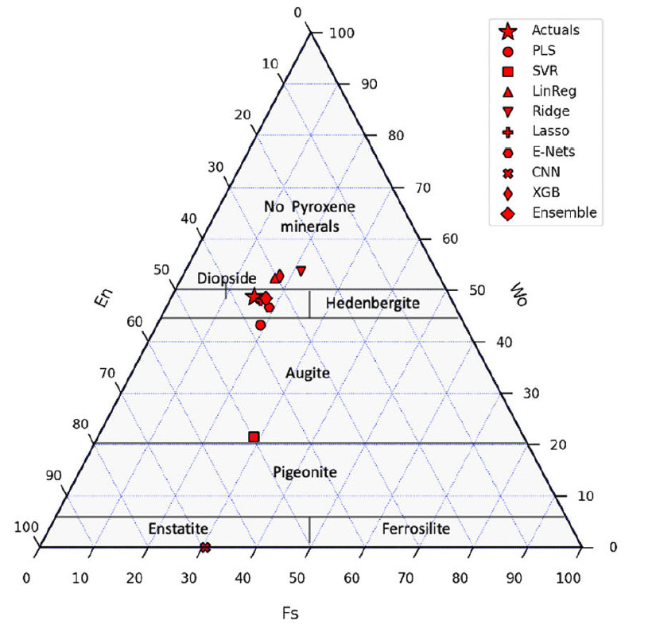

# Chem-Ternary
Simple Python Script for plotting geochemical samples on a ternary plot

The script takes in two arguments:
1) The data file (xlsx file that needs to be in SPECIFIC format)
2) The parameter file (see example)

The plot is a ternary plot of points for a specific rock sample and in comparison from its actual composition to various machine learning algorithms.

